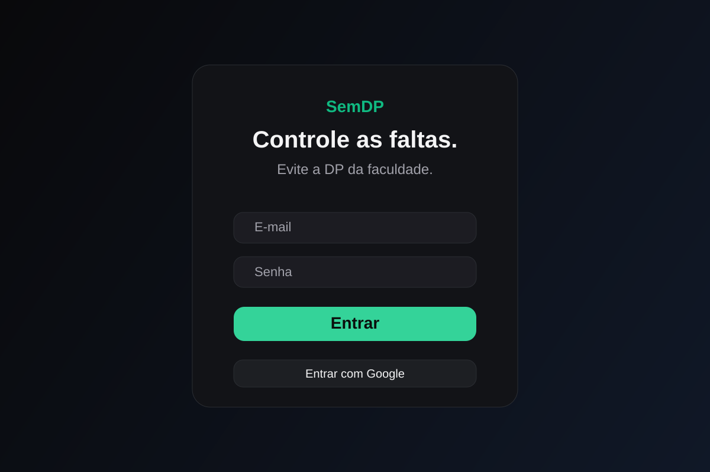
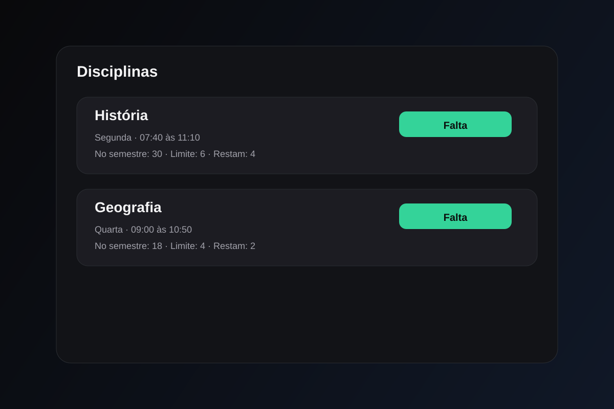

# SemDP

SemDP é um app para controlar faltas ao longo do semestre e acompanhar se a presença está dentro do limite da disciplina.

O objetivo é simples: deixar o estudante sem precisar ficar calculando manualmente quanto já faltou, quanto ainda pode faltar e quando a disciplina entra em risco de DP.

O projeto foi pensado para uso real no dia a dia da universidade, com uma interface direta, dados por usuário e cálculo automático de presença.

## Tecnologias

- React + Vite
- TypeScript
- Tailwind CSS
- Firebase Authentication
- Cloud Firestore

## O que ele faz

- cadastra disciplinas e percentual mínimo de presença
- monta a grade semanal do semestre
- calcula aulas previstas no período
- registra faltas por data e disciplina
- mostra limite de faltas, faltas usadas e faltas restantes
- ignora feriados nacionais e dias de recesso cadastrados
- mostra o próximo feriado em destaque no dashboard
- permite login com e-mail e Google
- mantém os dados separados por usuário no Firebase

## Como funciona

Você define o período do semestre e a grade de aulas. A partir daí, o app calcula quantas aulas existem no período e a quantidade máxima permitida para manter a presença dentro do mínimo da disciplina.

Quando uma falta é registrada, o sistema atualiza o status da disciplina em tempo real e deixa claro se o aluno ainda está dentro do limite ou se já está em risco de DP.

## Interface

### Login



### Dashboard
(em construção)

### Disciplinas e faltas



## Estrutura do projeto

```text
src/
  components/
  context/
  lib/
  types.ts
public/
  logo.svg
  semdp_logo_dark.svg
  semdp_favicon_calendario.svg

docs/
  screenshots/
```

## Como rodar localmente

```bash
npm install
cp .env.example .env
npm run dev
```

Depois é só preencher as variáveis do Firebase no arquivo `.env` com as chaves do projeto.

## Build

```bash
npm run build
```

## Observações

- o cálculo considera blocos de 50 minutos por aula
- o calendário considera feriados nacionais e recessos cadastrados pelo usuário
- a ideia principal do projeto é reduzir a fricção de acompanhar presença em faculdade sem depender de planilha ou cálculo manual

## Status

Projeto funcionando e em evolução, com foco em experiência prática, clareza visual e uso real no cotidiano acadêmico.
