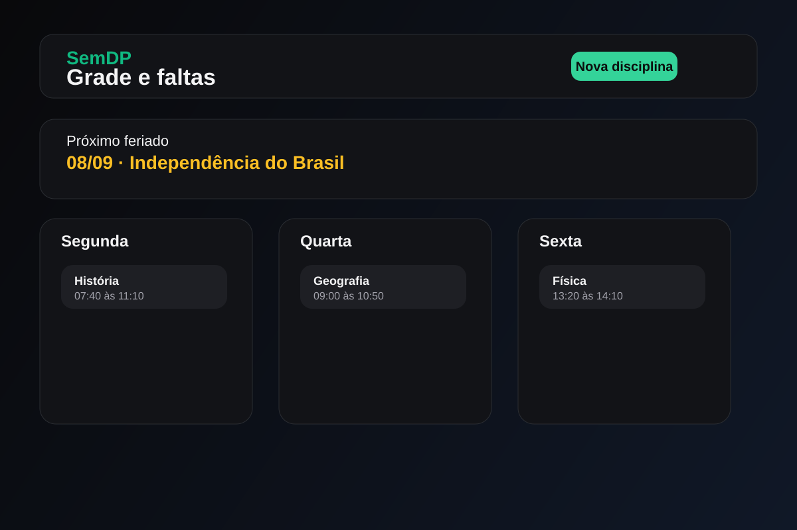

# SemDP

SemDP é um painel para controle de presença acadêmica, com foco em evitar a DP e manter o percentual de presença sempre em dia. O usuário insere o semestre, a grade semanal, as faltas por disciplina e o sistema calcula automaticamente o limite de faltas por percentual e o status de risco.

A proposta do projeto é simples e útil: ao invés de controlar presença manualmente em planilhas, o estudante consegue acompanhar aulas, feriados, recesso e limites em um único lugar.

## Stack

- React + Vite
- TypeScript
- Tailwind CSS
- Firebase Authentication
- Cloud Firestore

## Principais funcionalidades

- Cadastro de disciplinas e percentual mínimo de presença
- Grade semanal com dia, horário e disciplina
- Cálculo automático de aulas no semestre
- Registro de faltas com quantidade por aula
- Exibição de limite de faltas, faltas usadas e restante
- Identificação de feriados nacionais e recessos
- Próximo feriado destacado no dashboard
- Autenticação por e-mail e Google
- Dados por usuário em Firestore

## Diferencial do produto

O projeto resolve um problema real do cotidiano universitário: acompanhar presença e entender rapidamente se o aluno está em risco de perder a DP. A experiência foi pensada para ser objetiva, com dashboard enxuto e foco em leitura rápida de indicadores.

## Screenshots

### Login


### Dashboard



### Disciplinas e faltas


## Estrutura do projeto

```text
src/
  components/      Componentes da interface
  context/         Contexto de autenticação
  lib/             Utilitários de calendário, datas e Firebase
  types.ts         Tipos principais da aplicação
public/
  assets/

docs/
  screenshots/     Imagens para apresentação do projeto
```

## Como executar

```bash
npm install
cp .env.example .env
npm run dev
```

Preencha as variáveis de ambiente do Firebase em `.env` e inicie o projeto.

## Build

```bash
npm run build
```

## Observações

- O app foi pensado para uso acadêmico em semestres e calendário universitário
- O cálculo de aulas considera blocos de 50 minutos por aula
- A lógica de feriados e calendário foi ajustada para evitar erros de data e tratar melhor o período do semestre

## Status

Projeto funcional e em evolução contínua, com foco em usabilidade, clareza dos dados e experiência acadêmica mais tranquila.
