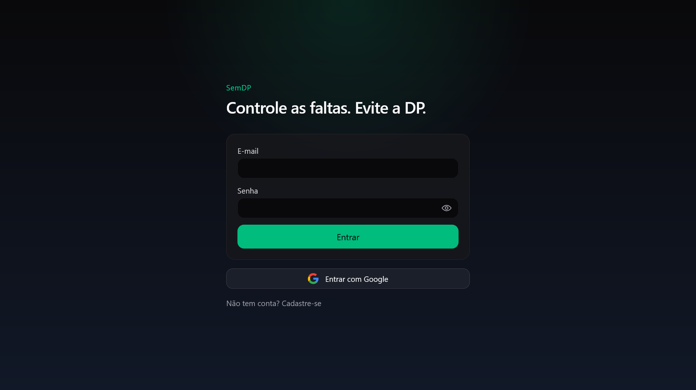
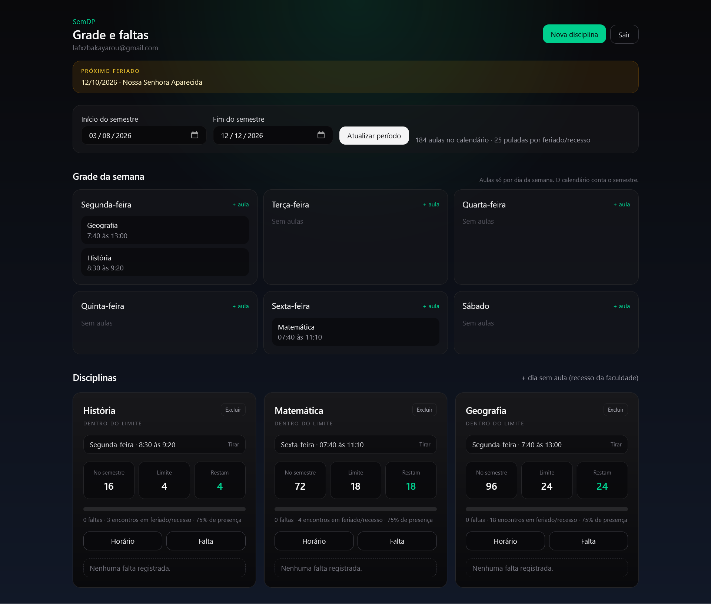

# SemDP

Quantas faltas eu ainda posso ter sem pegar DP?

Essa é uma dúvida que praticamente todo universitário tem durante o semestre.

O SemDP automatiza esse cálculo considerando o total oficial de aulas informado pelo usuário, o percentual mínimo de presença e as faltas registradas.

permitindo acompanhar em tempo real o risco de reprovação por frequência.

## Tecnologias

- React + Vite
- TypeScript
- Tailwind CSS
- Firebase Authentication
- Cloud Firestore

## O que ele faz

- cadastra disciplinas, total de aulas e percentual mínimo de presença
- associa um ou mais dias da semana a cada disciplina e organiza a grade semanal
- calcula o limite exclusivamente a partir do total de aulas e da presença mínima
- registra faltas por data e disciplina
- mostra limite de faltas, faltas usadas e faltas restantes
- valida a data da falta usando o semestre, os dias da disciplina, feriados e recessos
- resume aulas, faltas usadas e disciplinas em risco de DP no dashboard
- mostra o próximo feriado como informação auxiliar
- permite login com e-mail e Google
- mantém os dados separados por usuário no Firebase

## Algoritmos implementados

✓ cálculo de frequência  
✓ projeção de faltas  
✓ calendário acadêmico  
✓ tratamento de feriados  
✓ autenticação  
✓ persistência em nuvem

## Interface

### Login

### Disciplinas e faltas

## Roadmap

Próximas funcionalidades planejadas:

- Transformar o SemDP em um Progressive Web App (PWA)
- Instalação direta no celular e desktop
- Funcionamento offline para consulta e registro de faltas
- Sincronização automática quando a conexão retornar
- Estatísticas de presença por disciplina
- Notificações para disciplinas próximas do limite de faltas

## Observações

- o total de aulas é informado pelo usuário e não é reduzido por feriados ou recessos
- os dias da semana servem para organizar a grade e validar faltas, sem interferir no limite
- o calendário considera feriados nacionais e recessos cadastrados ao validar datas
- a ideia principal do projeto é reduzir a fricção de acompanhar presença em faculdade sem depender de planilha ou cálculo manual

## Acesso

O SemDP está disponível diretamente pelo navegador, sem necessidade de instalação ou configuração.

Em versões futuras, o projeto também poderá ser instalado como aplicativo (PWA) em celulares Android, iPhone e computadores compatíveis.
